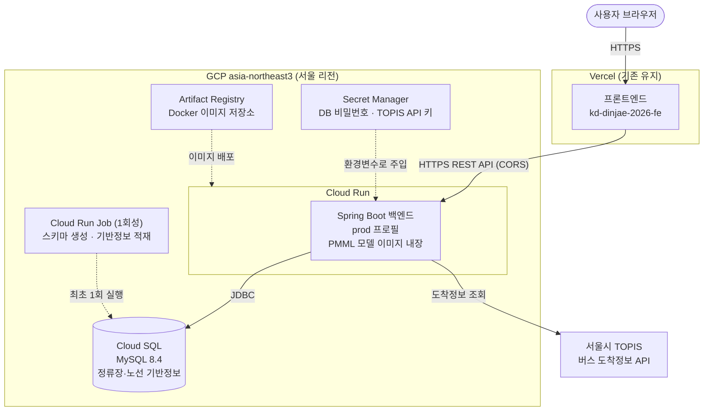
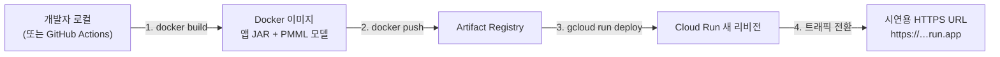

# 시연용 클라우드 아키텍처

시연회에서 백엔드를 실제 클라우드에 띄워 프론트엔드(Vercel)와 연동하기 위한 배포 구성을 정리한다.
결론은 **GCP(Cloud Run + Cloud SQL) 추천**이며, 근거와 전체 구성, 배포 절차, 시연 당일 체크리스트를 담는다.

## 1. AWS vs GCP 선택

### 결론: GCP

시연이라는 목적에 맞춰 "가장 적은 설정으로, 가장 적은 비용에, HTTPS URL 하나를 안정적으로 띄우는 것"을
기준으로 비교했다.

| 비교 항목 | GCP (Cloud Run) | AWS (동급 구성) |
|---|---|---|
| HTTPS 엔드포인트 | 배포 즉시 `*.run.app` HTTPS URL 자동 발급 | ALB + ACM 인증서 + 도메인 구성 필요 (App Runner를 쓰면 자동이나 상대적으로 비주류) |
| 컨테이너 배포 난이도 | `gcloud run deploy` 한 줄 | ECS/Fargate는 클러스터·태스크 정의·LB 등 구성 요소가 많음 |
| 무료 크레딧 | 신규 계정 $300 / 90일 → 시연 기간 전체를 사실상 무료로 커버 | 신규 계정 크레딧 제공(정책 변동이 잦아 금액·조건 확인 필요) |
| 유휴 비용 | scale-to-zero — 시연·리허설 외 시간에는 컨테이너 비용 0 | EC2/Fargate는 상시 과금, App Runner는 대기 비용 존재 |
| 서울 리전 | asia-northeast3 | ap-northeast-2 |
| 업계 친숙도 | 상대적으로 낮음 | 국내 채용·실무에서 지배적 |

**GCP를 추천하는 결정적 이유는 HTTPS다.** 프론트엔드가 Vercel(HTTPS)에서 서비스되므로,
백엔드가 HTTP면 브라우저가 혼합 콘텐츠(mixed content)로 차단해 API 호출 자체가 실패한다.
Cloud Run은 배포 즉시 관리형 HTTPS URL을 주기 때문에 인증서·도메인·로드밸런서 작업이 전부 생략된다.
AWS에서 같은 결과를 얻으려면 도메인 구매와 ALB/ACM 구성이 추가로 필요하다.

여기에 $300 무료 크레딧이 Cloud SQL 비용까지 흡수하므로, 시연 준비~당일까지 실비용이 거의 발생하지 않는다.

### AWS를 선택해도 되는 경우

- 팀원이 이미 AWS 사용 경험이 있거나 기존 크레딧을 보유한 경우
- 취업 포트폴리오 관점에서 AWS 경험을 남기고 싶은 경우

이 경우 아래 매핑대로 동일한 구조를 만들 수 있다.

| 역할 | GCP | AWS |
|---|---|---|
| 컨테이너 실행 | Cloud Run | App Runner 또는 ECS Fargate |
| 관리형 MySQL | Cloud SQL | RDS for MySQL |
| 이미지 저장소 | Artifact Registry | ECR |
| 시크릿 관리 | Secret Manager | Secrets Manager |
| 초기 데이터 적재 잡 | Cloud Run Jobs | ECS 일회성 태스크 |

## 2. 전체 아키텍처



### 구성 요소별 설명

**Cloud Run — Spring Boot 백엔드.**
Dockerfile로 빌드한 이미지를 그대로 실행한다. `prod` 프로필로 기동하며, 필요한 값은 모두
환경변수로 주입한다(`DB_URL`, `DB_USERNAME`, `DB_PASSWORD`, `SEOUL_BUS_API_KEY`, `ML_MODEL_DIR`).
`application-prod.yaml`에 이미 `forward-headers-strategy: framework`가 설정되어 있어
Cloud Run 프록시 뒤에서도 요청 스킴·호스트가 올바르게 인식된다. 즉 현재 prod 프로필 구성이
이 배포 형태에 그대로 들어맞는다.

**PMML 모델 파일.**
`model_a.pmml`, `model_b.pmml`과 범주 매핑 JSON은 Docker 이미지 빌드 시 `/models` 경로에 함께
복사한다(`ML_MODEL_DIR=/models`). 시연 규모에서는 GCS 같은 외부 저장소보다 이미지에 굽는 편이
단순하고, 모델이 업데이트되면 이미지를 다시 빌드·배포하면 된다. 모델 파일과 매핑 JSON은
반드시 같은 버전 짝으로 교체한다.

**Cloud SQL — MySQL 8.4.**
로컬 compose와 동일한 MySQL 8.4로 만들어 환경 차이를 없앤다. 시연 트래픽에는 최소 사양
(공유 코어 1 vCPU급)이면 충분하다. Cloud Run에서 Cloud SQL 커넥터 또는 퍼블릭 IP + 승인된
네트워크로 연결하고, 접속 정보는 Secret Manager를 거쳐 환경변수로 주입한다.

**Cloud Run Job — 초기 데이터 적재 (1회성).**
prod 프로필은 `ddl-auto: validate`라서 스키마가 미리 존재해야 한다. 최초 1회에 한해
스키마 생성과 정류장·노선 기반정보 적재(`app.master-data.import-enabled=true` + 기반정보 파일)를
수행하는 잡을 실행한다. 이후 서비스 컨테이너는 읽기만 한다.

**서울시 TOPIS API.**
백엔드가 아웃바운드로 호출한다. 일부 공공 API는 해외 IP 접근이 제한되는 경우가 있으므로
서울 리전에서 호출하는 것이 안전하다.

**Vercel 프론트엔드 (변경 없음).**
백엔드 URL만 Cloud Run 주소로 바꾸면 된다. 백엔드 CORS 허용 목록에는 이미
`https://kd-dinjae-2026-fe.vercel.app`이 등록되어 있다.

## 3. 배포 파이프라인



시연 준비 단계에서는 로컬에서 `gcloud` CLI로 수동 배포하면 충분하다.
배포가 잦아지면 GitHub Actions에서 `main` 머지 시 위 1~3단계를 자동화할 수 있다
(GCP 공식 `google-github-actions/deploy-cloudrun` 액션 사용).

배포 명령 예시:

```bash
# 1) 이미지 빌드 & 푸시 (Cloud Build에 위임하는 형태)
gcloud builds submit --tag \
  asia-northeast3-docker.pkg.dev/<PROJECT>/backend/backend:latest

# 2) Cloud Run 배포
gcloud run deploy backend \
  --image asia-northeast3-docker.pkg.dev/<PROJECT>/backend/backend:latest \
  --region asia-northeast3 \
  --set-env-vars SPRING_PROFILES_ACTIVE=prod,ML_MODEL_DIR=/models \
  --set-secrets DB_PASSWORD=db-password:latest,SEOUL_BUS_API_KEY=topis-key:latest \
  --add-cloudsql-instances <PROJECT>:asia-northeast3:<INSTANCE> \
  --allow-unauthenticated
```

## 4. 시연 당일 체크리스트

- [ ] **최소 인스턴스 1로 설정** (`--min-instances 1`): JVM 콜드 스타트가 10초 이상 걸릴 수 있어,
      시연 중 첫 요청이 늦어지는 사고를 막는다. 시연 종료 후 0으로 되돌려 비용을 아낀다.
- [ ] Cloud SQL 인스턴스 기동 상태 확인 (중지해뒀다면 시연 전날 재시작)
- [ ] TOPIS API 키 유효성 확인 (일일 호출 한도 포함)
- [ ] 프론트엔드 환경변수의 백엔드 URL이 Cloud Run 주소인지 확인
- [ ] `/swagger-ui.html` 및 헬스체크 엔드포인트로 리허설 호출
- [ ] PMML 모델·매핑 JSON 버전이 최신 전달본과 일치하는지 확인

## 5. 예상 비용

| 항목 | 예상 비용 (크레딧 미적용 시) |
|---|---|
| Cloud Run | 시연·리허설 수준 트래픽이면 월 수천 원 이하 (유휴 시 0) |
| Cloud SQL 최소 사양 | 월 1~2만 원 수준 |
| Artifact Registry·Secret Manager·네트워크 | 무시할 수 있는 수준 |

신규 계정 $300 크레딧(90일) 안에서 준비 기간과 시연까지 **실지출 없이** 운영 가능한 규모다.
시연이 끝나면 Cloud SQL 인스턴스만 중지해도 과금 대부분이 멈춘다.

## 6. 플랜 B — 단일 VM + docker compose

관리형 서비스 없이 Compute Engine(또는 EC2) VM 한 대에 docker compose로 앱과 MySQL을 함께
띄우는 방법도 있다. 구성 요소가 하나뿐이라 이해하기 쉽고 로컬 개발 환경과 완전히 동일하다는
장점이 있으나, HTTPS를 직접 구성해야 하고(Caddy/nginx + Let's Encrypt) VM 관리 부담이 생긴다.
Cloud Run 방식에 문제가 생겼을 때의 대비책으로만 남겨둔다.

## 7. 부록 — 필요 리소스·기술 정리

### 생성해야 할 GCP 리소스

| # | 리소스 | 권장 사양·설정 | 역할 |
|---|---|---|---|
| 1 | GCP 프로젝트 + 결제 계정 | 신규 계정 $300 크레딧 활성화, 리전은 전부 `asia-northeast3` | 모든 리소스의 컨테이너 |
| 2 | Cloud Run 서비스 `backend` | 1 vCPU / **메모리 1GiB**, min 0(시연일 1) / max 2, 포트 8080, 미인증 호출 허용 | Spring Boot 백엔드 실행 |
| 3 | Cloud SQL 인스턴스 | **MySQL 8.4**(로컬 compose와 동일), 공유 코어 최소 사양(db-f1-micro급), SSD 10GiB, 데이터베이스 1개 + 앱 전용 계정 | 정류장·노선 기반정보 저장 |
| 4 | Artifact Registry 저장소 | Docker 형식, `asia-northeast3` | 백엔드 이미지 저장 |
| 5 | Secret Manager 시크릿 | `db-password`, `topis-api-key` 2건 | 민감 정보를 코드·이미지 밖으로 분리 |
| 6 | Cloud Run Job `backend-init` | 서비스와 같은 이미지, `app.master-data.import-enabled=true`로 실행 | 최초 1회 스키마 생성·기반정보 적재 |
| 7 | 런타임 서비스 계정 | 역할: `roles/cloudsql.client`, `roles/secretmanager.secretAccessor` | Cloud Run이 DB·시크릿에 접근할 권한 |

메모리는 1GiB를 권장한다. JVM 기본 설정에서 512MiB는 기동 중 OOM으로 죽는 경우가 흔하다.

프로젝트에서 활성화할 API (콘솔에서 켜거나 `gcloud services enable`):

```
run.googleapis.com            # Cloud Run
sqladmin.googleapis.com       # Cloud SQL
artifactregistry.googleapis.com
secretmanager.googleapis.com
cloudbuild.googleapis.com     # gcloud builds submit 사용 시
```

### 코드 쪽에서 준비할 것

**Dockerfile (신규 작성 필요).** 멀티 스테이지로 Gradle 빌드 후 JRE 21 이미지에 JAR와
PMML 모델을 담는다.

```dockerfile
FROM gradle:8-jdk21 AS build
WORKDIR /app
COPY . .
RUN gradle bootJar --no-daemon

FROM eclipse-temurin:21-jre
WORKDIR /app
COPY --from=build /app/build/libs/*.jar app.jar
COPY models/ /models/
ENTRYPOINT ["java", "-jar", "app.jar"]
```

**Cloud SQL 소켓 팩토리 의존성 (build.gradle에 추가).** Cloud Run은 `--add-cloudsql-instances`로
연결한 인스턴스를 유닉스 소켓으로 노출하는데, MySQL 드라이버가 이를 쓰려면 커넥터 라이브러리가 필요하다.

```gradle
implementation 'com.google.cloud.sql:mysql-socket-factory-connector-j-8:1.21.0'
```

이때 `DB_URL` 환경변수는 다음 형식이 된다.

```
jdbc:mysql:///mydatabase?cloudSqlInstance=<PROJECT>:asia-northeast3:<INSTANCE>&socketFactory=com.google.cloud.sql.mysql.SocketFactory
```

### 팀이 익혀야 할 도구

| 도구 | 용도 | 학습 부담 |
|---|---|---|
| `gcloud` CLI | 빌드 제출, Cloud Run 배포, 시크릿 등록 | 낮음 — 문서의 명령 예시로 충분 |
| Docker / Dockerfile | 이미지 빌드 (로컬 검증용) | 낮음 — compose 경험 보유 |
| Cloud 콘솔 | Cloud SQL 생성, 로그 확인(Cloud Logging) | 낮음 |
| GitHub Actions (선택) | `main` 머지 시 자동 배포 | 중간 — 수동 배포로 시작 권장 |
